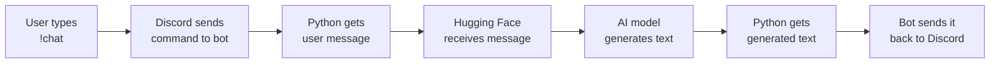

# Discord-Story-Bot

### 
Bot-Architecture

```mermaid
graph LR
    A[User types<br>!chat] --> B[Discord sends<br>command to bot]
    B --> C[Python gets<br>user message]
    C --> D[Hugging Face<br>receives message]
    D --> E[AI model<br>generates text]
    E --> F[Python gets<br>generated text]
    F --> G[Bot sends it<br>back to Discord]
```